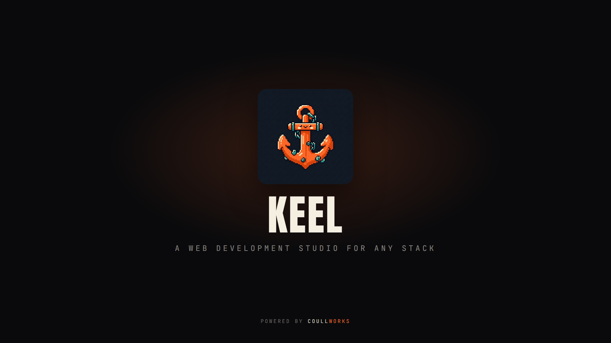

<p align="center">
  
</p>

<h1 align="center">keel</h1>

<p align="center">
  <b>A web development studio for any stack.</b><br>
  Pick a language, a framework and an architecture, and keel builds the whole project the way the framework itself intends — running the real, documented installers, wiring the services and your <code>.env</code>, not just dumping app code in a folder.
</p>

<p align="center">
  <a href="LICENSE"></a>
  
  
  
</p>

---

```
$ keel new laravel --with filament,redis,pest

  Keel plan  ·  laravel
  ──────────────────────────────────────────────
  framework  Laravel
  env        DDEV
  db         MySQL
  service    Redis
  addon      Filament (admin panel)
  extra      Pest (tests)

  steps, in order
    $ ddev config --project-type=laravel --docroot=public
    $ ddev start
    $ ddev composer create laravel/laravel .
    $ ddev composer require filament/filament
    $ ddev exec php artisan filament:install --panels --no-interaction
    $ ddev add-on get ddev/ddev-redis
    ...
```

## Why

Most generators lay down *app code* and stop; environment tools spin up *services*
and don't scaffold. AI tools do a bit of both, badly — they hand-roll the setup,
guess the config, skip steps, and leave something quietly missing that bites you
weeks later.

keel owns the join. You tell it what you're building with and it runs the real,
documented commands in the right order — `composer create-project`, `artisan`,
`npm`, `uv sync`, `django-admin`, `ddev` — resolving what depends on what and
wiring the services and your `.env` the way the framework expects. What comes back
isn't a best guess at a project. It's a proper one, built and ready to run.

## Install

```sh
curl -fsSL https://raw.githubusercontent.com/coullworks/keel/main/install.sh | sh
```

Or with Go 1.22+:

```sh
go install github.com/coullworks/keel/cmd/keel@latest
```

Then check your machine has what the stacks need, and update in place later:

```sh
keel doctor        # check the host tools keel shells out to (Docker, Node/nvm, DDEV…)
keel self-update   # update keel to the latest release
```

## Quick start

```sh
keel new                                     # interactive: Language → Framework → Env → …
keel new fastapi --js                         # or flag-driven (JavaScript/TypeScript for Node stacks)
keel new laravel --with filament,redis,pest   # a whole stack in one command
keel new django --dry-run                     # show the exact steps, run nothing
keel studio                                   # or build it in a browser
```

## Frameworks & stacks

**22 frameworks across three runtimes**, each scaffolded with its own official tooling.
Node frameworks build as **JavaScript or TypeScript** (`--js` / `--ts`).

| Runtime | Frameworks |
|---|---|
| **Node** | Next.js, Nuxt, SvelteKit, Astro, NestJS, Express, Fastify, Hono, AdonisJS |
| **Python** | Django, FastAPI, Flask, Streamlit, Gradio, Dash, Reflex |
| **PHP** | Laravel, Symfony, Magento, Mage-OS, WooCommerce, WooCommerce (Bedrock) |

- **Local dev environments:** DDEV · Docker · Local (native) · Sail · Bedrock-DDEV
- **Services, wired in:** PostgreSQL, MySQL, MariaDB, MongoDB, Supabase, Redis, Memcached, RabbitMQ, MinIO, Meilisearch, Elasticsearch, OpenSearch, and more — connected, ported and written into your `.env`.
- **Add-ons & frontends:** curated per stack (Filament, Telescope, Larastan, DRF, Celery, Auth.js, Tailwind, shadcn, Hyvä, Playwright, Pest/Vitest, …).
- **282 recipes in total** — all just data, so anyone can add a stack.

Whatever env you pick, keel installs the tool it needs (ddev/docker) the right way
per platform (macOS/Linux/WSL), or guides you if it can't.

## Commands

keel is one vocabulary across every stack. Full list:

**Scaffold & generate**

```sh
keel new [framework]      # scaffold a project (interactive or flag-driven)
keel gen                  # generate components, framework-aware (artisan make, bin/console, manage.py…)
keel new-recipe [--pack]  # scaffold your own recipe or pack
keel track [path]         # list an existing project (detect its stack; no manifest)
keel adopt                # adopt an existing project so keel can manage it (writes a manifest)
```

**Run & manage a project**

```sh
keel status               # framework, env, services, database and quick stats
keel run [task]           # dev · test · lint · typecheck · build, one command across every stack
keel db [migrate|seed|reset|status]   # database tasks through your env
keel secrets [sync|list|generate|audit]  # manage .env, generate keys, catch committed secrets
keel service [start|stop|restart]     # control one env service (bare = list them)
keel proxy                # serve every running project at <name>.localhost
keel update               # refresh keel-owned files to the latest recipes (non-destructive)
keel delete               # tear down a project's env, remove it, untrack it
```

**Brand, generate & commerce**

```sh
keel brand "#ff6a2c" --accent "#7c5cff" --radius 14px   # full no-code theming: colour, accent, radius, font, logo, favicon (Tailwind + Bootstrap)
keel commerce             # make a store AI-agent-ready (JSON-LD, product feed, agents manifest)
```

**Quality**

```sh
keel doctor               # check the host tools keel shells out to
keel optimize             # scan a project for security, performance and hygiene issues (read-only)
```

**Studio, console & AI**

```sh
keel studio               # a visual stack builder in your browser
keel console              # full-screen multi-panel terminal UI
keel mcp                  # run as an MCP server so AI coding agents can drive keel
```

The **console** and the **studio** offer the same actions — build a stack, track
and manage projects, generate code, run tasks, packs and plugins — so you can work
entirely in the terminal or in the browser. The only browser-only surface is the
studio's visual database grid; the console gives you the database *tasks* instead.

> Commands like `keel sonar` (AI-visibility audit) and `keel ai-core` (per-stack AI
> assistant rules) come from **plugins**, not core keel — see [Extend keel](#extend-keel)
> below. Each plugin documents its own commands in its own repo.

**Extend keel**

```sh
keel recipes list                              # built-ins + installed packs, grouped by trust
keel recipes add <git-url|owner/repo|path>     # install a pack (fetch + validate; never runs its code)
keel recipes validate <path>                   # lint a recipe or pack
keel recipes remove <pack>
keel plugins                                   # list plugins and what each one adds
keel add / keel remove                         # add or remove recipes on a built project
```

**Config & housekeeping**

```sh
keel init                 # set your engineer profile defaults once
keel config               # view or set those defaults
keel deploy [compose|fly|vps|render|railway|vercel]   # generate production deploy artifacts
keel completion <shell>   # shell autocompletion
keel self-update          # update to the latest release
keel sponsor              # support keel's development
```

**AI-native.** `keel mcp` exposes keel over the Model Context Protocol (read-only by
default). Agents select and parameterise *tested* recipes; keel runs the real,
deterministic installers. **AI chooses, keel guarantees.**

## Extend keel

keel ships **zero** built-in plugins. A **plugin** is a git repo that adds commands,
studio pages/screens and actions (sonar and ai-core are the reference plugins); a
**pack** is a git repo of recipe YAML plus lifecycle hooks. Clone either anywhere
under your home directory and keel discovers it — no configured path — or install
into the managed dir:

```sh
keel plugins                                 # list discovered plugins and what each adds
keel plugins add <git-url|owner/repo|path>   # install a plugin (fetch + validate; never runs its code)
keel plugins trust <name>                    # let keel run its code (separate, explicit consent)
```

A plugin's code stays **untrusted until you `trust` it**, and each capability
(`net`, `secrets`, `exec`) is granted separately. See
[docs/PLUGIN-STANDARD.md](docs/PLUGIN-STANDARD.md) to build one.

Recipes are data, and packs are git repos of recipe YAML plus lifecycle hooks:

```sh
keel recipes add <git-url|owner/repo|path>   # install a pack
keel new-recipe my-stack --pack              # scaffold your own pack repo
```

Packs install into `~/.config/keel/recipes/` and are **untrusted by default**: on a
build that uses one, keel prints the exact commands and asks before running any
third-party shell (`--trust` to opt in). Install is pure file operations and never
runs code.

**Lifecycle hooks** (`pre_build`, `post_recipe`, `post_create`, `post_build`,
`post_open`) let a recipe run declarative commands or a script at each stage:

```yaml
hooks:
  post_create:
    - run: "{{artisan}} key:generate"
  post_build:
    - message: "Done. Next: cd {{project}} && {{start}}"
```

## How it works

- **Recipes are data.** Every node (framework, env, db, service, frontend, add-on,
  extra) is a small YAML recipe with `requires` / `conflicts` / `provides` metadata.
  The resolver composes a validated, ordered plan; invalid combos are refused.
- **One command vocabulary.** Recipes template against `{{composer}}`, `{{artisan}}`,
  `{{manage}}`, `{{start}}`… which each env defines, so one recipe runs identically
  under DDEV, Sail, Docker or Local.
- **Thin orchestrator.** keel shells out to the ecosystems' own installers
  (`composer`, `ddev`, `sail`, `uv`, `npm`, `artisan`, `bin/magento`) and owns only
  the join: env config and `.env` / settings wiring.
- **Single static binary.** Built-in recipes and the studio UI are embedded via
  `go:embed`; no runtime assets.

## Development

```sh
make build        # compile bin/keel (embeds the committed studio UI)
make test         # go test ./... — unit (TDD) + BDD scenarios
make lint         # vet + gofmt + repo hygiene checks
```

**Studio UI.** The browser studio is a React app in `internal/studio/web`, built to
`internal/studio/web/dist` and embedded into the binary via `go:embed`. That dist is
a **committed artifact**, so a plain `make build` needs no Node toolchain — but after
editing the studio source you must rebuild and commit it:

```sh
make web          # cd internal/studio/web && pnpm install && pnpm build
make build        # re-embed the rebuilt dist
# then commit internal/studio/web/dist
```

Skipping `make web` means the binary embeds the **old** studio. The React studio is
the default; set `KEEL_STUDIO_LEGACY=1` to fall back to the legacy UI.

## Privacy

keel ships **zero telemetry**. No account, no tracking, nothing collected. The only
network calls it makes are the ones you ask for: installing a tool, pulling a recipe
pack, or fetching a framework's own installer.

## Support

keel is free and open source. If it saves you time: `keel sponsor` (or
[github.com/sponsors/coullworks](https://github.com/sponsors/coullworks)).

## License

[MIT](LICENSE) © CoullWorks

---

<p align="center">
  <a href="https://coullworks.com"><b>⚓ Powered by CoullWorks</b></a><br>
  <sub>Built in the open by <a href="https://coullworks.com">CoullWorks</a> — web &amp; software engineering. <a href="https://coullworks.com">coullworks.com</a></sub>
</p>
